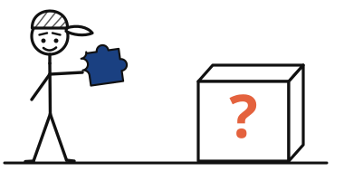
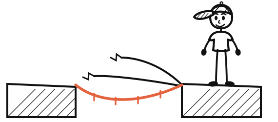
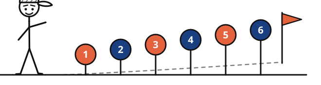
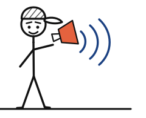

# Jamie Clarke — Design System

**Version 1.0 · Documented from the live build of [jamieclarke.online](https://jamieclarke.online)**

This is the written reference for the brand's visual language. The companion file
[`design-system.html`](./design-system.html) is the same system rendered as a living style guide —
open it in a browser to see every component in its real states.

Tokens below were read directly from the site's compiled Tailwind v4 theme, not eyeballed from
screenshots.

---

## 1. What this brand is

Jamie Clarke helps service businesses — trades, coaches, consultants, accountants — get found, get
enquiries and get customers. The audience is a business owner who is excellent at their actual job
and underserved by their marketing. They are not designers, they are short of time, and they have
been sold to badly before.

Everything in this system serves three jobs:

1. **Be readable.** High contrast, plain English, generous type.
2. **Be trusted.** Real photos, real testimonials, honest microcopy about what's free.
3. **Point at one next step.** Orange marks it. Nothing else competes.

### Five principles

| # | Principle | What it means in practice |
|---|-----------|---------------------------|
| 1 | Confident, not corporate | Solid borders and hard offset shadows over gradients and glass. Drawn with a marker pen, not rendered in a boardroom. |
| 2 | One next step per screen | Orange is reserved for the single most important action in view. Two orange buttons means one is wrong. |
| 3 | Plain English, always | Copy is design material. Short sentences. Say what the button does and what happens after. |
| 4 | Warmth over polish | Cream grounds, hand-drawn stick figures, a card tilted 2°. Trust comes from warmth, not gloss. |
| 5 | Order is the message | The Perfect Customer Journey is six stages in sequence. Number sequential content; never number a list that isn't one. |

---

## 2. Colour

Three colours carry the brand, three support it.

| Token | Hex | Role |
|-------|-----|------|
| `navy` | `#1B3C7F` | Ink and structure. All text, every border, every hard shadow, plus full-bleed panels. |
| `orange` | `#E2613D` | Action. Primary buttons, prose links, eyebrow labels, focus rings. |
| `cream` | `#FBF5EA` | Resting surface. Section bands, quote blocks, card media wells. |
| `teal` | `#43BCCD` | Support. Third colour in a numbered sequence, illustration fills. Never text on white. |
| `yellow` | `#F9C80E` | Highlight. Sticker badges only, always with navy text and a navy border. |
| `white` | `#FFFFFF` | Default page ground. |
| `mist` | `#F6F7FB` | Navy-biased neutral for inert rows and code wells. |

### Transparency ladder

Secondary text is navy at reduced opacity, never a separate grey — it keeps the page tonally unified.

- `navy/80` — body copy that needs weight (blockquotes)
- `navy/70` — default body copy on white or cream
- `navy/45` — captions, legal microcopy, muted metadata
- `navy/12` — hairline rules and input borders
- `navy/5` — background wells

### Contrast (WCAG 2.1)

| Pairing | Ratio | Verdict |
|---------|-------|---------|
| Navy on white | 10.50 | AAA — default body text |
| Navy on cream | 9.68 | AAA — body text on cream bands |
| White on navy | 10.50 | AAA — navy panels |
| Navy on yellow | 6.65 | AA — sticker badges |
| Navy on teal | 4.66 | AA — step markers |
| White on orange | 3.49 | **Large/bold text only** — buttons must be ≥16px at 700 |
| Orange on white | 3.49 | **Large/bold text only** — never body copy |

> Orange is a brand accent, not a text colour. Where orange text is small (eyebrows, inline links),
> set it at 700 weight and pair it with an underline or an adjacent navy label, so colour is never
> the only signal.

---

## 3. Typography

Two families. No exceptions.

- **Gabarito** — everything that shouts: headings, buttons, numbers, labels. Weights 500–900.
- **Maven Pro** — everything that explains: body, leads, captions, nav links. Weights 400–700.

```html
<link rel="stylesheet"
  href="https://fonts.googleapis.com/css2?family=Gabarito:wght@500;600;700;800;900&family=Maven+Pro:wght@400;500;600;700&display=swap">
```

### Scale

| Role | Family / weight | Size | Line height | Notes |
|------|-----------------|------|-------------|-------|
| Display / H1 | Gabarito 800 | 2.25rem → 3.5rem | 1.15 | `-0.015em` tracking, `text-wrap: balance` |
| Section / H2 | Gabarito 800 | 1.6rem → 2.25rem | 1.2 | |
| Card / H3 | Gabarito 700 | 1.25rem | 1.4 | |
| Eyebrow | Gabarito 700 | 0.75rem | 1 | uppercase, `0.14em` tracking, orange |
| Lead | Maven Pro 400 | 1.125rem | 1.7 | `navy/70` |
| Body | Maven Pro 400 | 1rem | 1.6 | `navy/70` |
| Small / caption | Maven Pro 400 | 0.875rem | 1.55 | `navy/45` |

### Rules

- Headings use sentence case, with a full stop when they read as a statement ("Things I'm working on.").
  Title Case is for proper nouns only — The Marketing Memo, The Perfect Customer Journey.
- Keep running text between 60 and 70 characters per line.
- Bold inside a paragraph is navy, never orange. It marks the sentence worth remembering.
- Never set body copy in Gabarito. Never set a button in Maven Pro.
- Long-form articles use the `prose` defaults: h2 at 1.5–1.875rem with 48px top margin, paragraphs at
  1.125rem/relaxed in `navy/70`, links bold orange with underline on hover, blockquotes on cream with
  a 4px orange left border and no italics.

---

## 4. Space & shape

Base unit **4px**. Every gap is a multiple of it.

| Step | Value | Typical use |
|------|-------|-------------|
| 2 | 8px | icon gaps, tight stacks |
| 3 | 12px | label to input |
| 4 | 16px | inside compact components |
| 6 | 24px | card padding, grid gaps |
| 8 | 32px | large card padding |
| 12 | 48px | section padding (mobile) |
| 16 | 64px | major block separation |
| 20 | 80px | section padding (tablet) |
| 24 | 96px | section padding (desktop) |

**Container:** `max-w-7xl` (1280px), gutters 16px / 24px / 32px at sm / md / lg.

### Radii

| Token | Value | Use |
|-------|-------|-----|
| `lg` | 8px | chips, flat buttons |
| `xl` | 12px | buttons, inputs, step markers |
| `2xl` | 16px | cards, images |
| `3xl` | 24px | full-width panels |
| `full` | 9999px | badges, avatars, dots |

Bigger surface, bigger radius. Don't mix two radii on one element.

---

## 5. Elevation — the chunky shadow

The signature of the brand. Elements sit on a solid navy offset, like a sticker on a page. There is
no blur, and the shadow colour is always navy.

| State | `btn-chunky` | `card-chunky` |
|-------|--------------|---------------|
| Rest | `4px 4px 0 navy` | `5px 5px 0 navy` |
| Hover | `7px 7px 0 navy` + `translate(-2px,-2px)` | `8px 8px 0 navy` + `translate(-2px,-3px)` |
| Active | `1px 1px 0 navy` + `translate(2px,2px)` | — |
| Transition | 180ms transform + box-shadow | 200ms transform + box-shadow |

Both variants also carry a **2px solid navy border**.

Soft shadows still exist, but only for things that genuinely float above the page: the sticky header,
the cookie bar, dropdowns. **Never put a soft shadow and a chunky shadow on the same element.**

---

## 6. Components

### Buttons

Gabarito 700, 12px radius, 2px navy border, chunky shadow. Label the outcome, not the mechanic —
"Get your free web review", not "Submit".

| Variant | Fill | Text | Use |
|---------|------|------|-----|
| Primary | orange | white | The one action that matters. Max one per viewport. |
| Secondary | white | navy | The alternative action, on white or on navy. |
| Navy | navy | white | Section-level actions on cream, where orange is already in use nearby. |
| Small | any | any | 0.875rem text, 11px/20px padding — nav bars, inline rows. |
| Flat | orange, no border, soft shadow | white | Dense UI inside a card (cookie bar, inline signup) where chunky would be too loud. |
| Ghost | transparent, white/30 border | white/80 | Genuinely minor actions on navy only ("No thanks"). |

Rules: minimum 44px tap target; arrows point right and follow the label with an 8px gap; no arrow on
form submits; full-width buttons only in forms and the mobile menu.

### Cards

White fill, 2px navy border, `card-chunky` shadow, 16px radius, `overflow-hidden`. The whole card is
the link target and the hover lift is the affordance.

- **Project card** — 2:1 media well on cream, title, one sentence, a bold orange "domain.com →" link.
- **Article card** — orange uppercase category tag, title, standfirst, "Read the article →".
- **Testimonial card** — oversized orange opening quote mark, quote in `navy/70` with the payoff line
  bolded in navy, then name and company.
- **Tilt variant** — up to 2° rotation, straightening on hover. Once per section, never across a grid.

### Badges & step markers

- **Badge** — pill, 2px navy border, yellow (or cream / teal) fill, Gabarito 700 at 0.82rem, rotated
  ~3°. Stickers: "Free forever", "New".
- **Eyebrow** — 0.72rem, uppercase, `0.12em` tracking, bold orange. Names a section, not a badge.
- **Step marker** — 48px square, 12px radius, solid fill, white Gabarito 800 numeral. Cycles
  orange → navy → teal. Only for genuinely sequential content.

### Forms

Inputs are quiet so the button can be loud: 1px `navy/12` border, 12px radius, 14px/18px padding,
`navy/30` placeholders. Focus is a **2px orange ring** — the one place orange appears without being a
call to action.

On navy panels: `white/10` fill, `white/20` border, `white/45` placeholder.

Messages read like a person:

- Success — "You're in! Check your inbox."
- Error — "Something went wrong. Please try again."
- Legal microcopy sits under the button at 0.78rem in `navy/45`, privacy link underlined.

Every input has a real label. Placeholder text is an example, never the label.

### Navy panels

Once or twice a page the ground flips to navy: 24px radius, 44px padding, white headings, `white/75`
body. Reserved for the moments that matter most — the newsletter signup, the closing CTA. A single
soft orange glow (18% at 50px blur) may sit behind one edge. One per panel, never animated.

### Header & footer

- **Header** — sticky, `white/95` with a backdrop blur and a `navy/12` hairline base. 80px tall on
  mobile, 96px on desktop. Logo left, Maven Pro 500 navy links (orange on hover) centre-right, one
  small orange chunky button far right. Below 768px links collapse to a full-width menu with the
  orange button pinned at the bottom.
- **Footer** — cream ground, four columns: brand line, Explore, Work With Me, Connect. Gabarito 700
  headings at 0.9rem, `navy/70` links turning orange on hover. Copyright and privacy link below.

---

## 7. Illustration

One recurring character does all the explaining. He is drawn in black ink on white, wears a baseball
cap in every frame, and never changes proportions between drawings. That consistency is what makes
the illustrations read as a set rather than a pile of clip art.

### Anatomy


| Feature | Rule |
|---------|------|
| Head | Round, slightly oversized relative to the body. White/empty inside, black outline. |
| Cap | Baseball cap **always** present. White with black cross-hatching. Never coloured. |
| Face | Small dot eyes, curved line mouth, short angled eyebrows. No nose, no ears. |
| Height | Roughly 3.5–4 head-heights tall. Head diameter is the unit for everything else. |
| Colour | Black ink on white only. The character is never coloured, and neither is any other figure. |
| Scale | Realistic human scale against the scene. Next to a lighthouse, the lighthouse towers over him. |
| Extras | Other stick figures in a scene are smaller and simpler than the main character. |

### Examples

| | |
|---|---|
|  |  |
| **Marketing without a plan** — a jigsaw with no picture on the box. One prop, one metaphor, nothing else in frame. | **Half-built bridges** — three attempts, one that lands. The finished bridge is the only orange element: the accent marks the answer, not the problem. |
|  |  |
| **The six stages** — the Perfect Customer Journey as posts rising towards a flag. Numbers alternate orange and navy; the sequence is the message. | **Get Noticed** — stage one on its own. Sound lines navy, megaphone orange, character untouched. |

Source files live in [`illustrations/`](./illustrations/) as SVG.

### Never

- No colour on the character — not his cap, not his clothes, not another stick figure.
- No third accent colour. Orange and navy only, on props and environment.
- No nose, no ears, no hair.
- No 3D, no photorealism, no clip art. Cartoon line illustration only.
- No long text in the artwork. Labels are short and bold, or they don't go in.

Colour stays sparing: a mostly black-and-white frame with a few accented objects is the target. If
the whole scene is orange, the accent has stopped meaning anything.

### Generation prompt

New illustrations are generated from the reference set with the prompt below. **Attach the existing
images every time** — they are the definitive guide, and the prompt only holds if the model can see
them.

```text
VISUAL STYLE INSTRUCTIONS

You generate stick figure illustrations based on prompts I give you. Your only job is to
create the image while keeping the character and style 100% consistent with the attached
reference images.

THE CHARACTER
Study the attached reference images. This is the definitive guide. Match it exactly every
time. Key details that must never change:
  - Round head, slightly oversized relative to body. White/empty inside, black outline.
  - Baseball cap ALWAYS present. White with black cross-hatching/sketch shading lines.
    Never coloured.
  - Simple face: small dot eyes, curved line mouth, short angled eyebrows. No nose, no ears.
  - Roughly 3.5-4 head-heights tall.
  - NEVER add any colour to the character. He is black ink on white only.

PROPORTIONS
The character must always be at realistic human scale relative to the objects and
environment around him. If he's next to a lighthouse, the lighthouse towers over him. If
he's at a desk, he's normal desk height. Don't make him oversized relative to the scene.

COLOURS
Only two accent colours are ever permitted (plus black and white):
  #E4623E (warm orange-red)
  #1A4081 (deep navy blue)
These go on objects, props, and environmental elements ONLY. Never on the character or
other stick figures. Use them sparingly - a few coloured accents on a mostly black and
white image is the goal.

STYLE
  - Clean white background
  - Black ink pen, hand-drawn feel with slight imperfection
  - Cartoon/illustration style, not clipart, not 3D, not photorealistic
  - Other stick figures in the scene should be simpler and smaller than the main character
  - Keep any text labels short and bold

THE PERFECT CUSTOMER JOURNEY
If the PCJ, Perfect Customer Journey or stages are mentioned, they are the 6 stages:
  1. Get Noticed   2. Connect       3. Engage
  4. Convert       5. Deliver & Wow  6. Create Fans
```

> **One thing to settle.** The illustration prompt uses `#E4623E` / `#1A4081`, while the website ships
> `#E2613D` / `#1B3C7F`. They are a shade apart — close enough to look like a mistake side by side,
> far enough that an illustration dropped next to a button won't quite match. Pick one pair and use it
> in both places; the site's values are the safer default, since they're already compiled into the
> build.

### Other imagery

1. **Photography of Jamie** — real and unposed. Portraits crop 4:5 on mobile, 3:4 on desktop, 16px
   radius. No stock photography of other people, ever.
2. **Product screenshots** — 2:1 well on cream, square to the frame. No perspective mockups, no
   floating device shells.
3. **Decorative shapes** — the soft orange blur behind a hero, a rotated cream slab behind a
   portrait: 5–10% opacity, never behind body text.

Alt text describes the idea, not the file: *"Stick figure looking at three bridges — only one fully
built across the gap."*

---

## 8. Voice & tone

British English, second person, contractions throughout. Jamie talks to one business owner at a time,
not to a market.

**The house line:** *"You're not bad at marketing. You're just doing things in the wrong order."*
Sympathetic about the problem, blunt about the cause, confident about the fix.

### Do

- Name the reader's situation before offering the fix: "You're posting on social media but the phone
  isn't ringing any more than it was."
- Use one concrete metaphor and follow it through — the jigsaw, the half-built bridge.
- Keep sentences short. Fragments are fine. They land.
- Be specific about what's free and what isn't.
- Let a little personality in (the golf, the Manchester United line), then get back to the point.

### Don't

- No agency language: leverage, synergy, solutions, bespoke, cutting-edge.
- Don't blame the reader. The problem is the order, not their ability.
- Don't stack three adjectives where one verb will do.
- Don't promise numbers you can't evidence — testimonials carry the proof.
- Don't write a heading that could sit on anyone else's website.

---

## 9. Accessibility

- **Focus is always visible** — 3px orange outline at 3px offset on every interactive element. Never
  remove it without replacing it.
- **Orange text is bold or large.** At 3.49:1 it fails AA for small body text.
- **Colour is never the only signal** — prose links are bold and underline on hover; step markers
  carry a number as well as a fill.
- **Motion is optional** — hover lifts and the logo marquee respect `prefers-reduced-motion`.
- **Headings nest properly** — one `h1` per page, no skipped levels; size comes from a class, not the
  tag.
- **Tap targets are 44px minimum**, including nav and footer social links.
- **Every image has meaningful alt text.**

---

## 10. Tokens

### Tailwind v4 theme

```css
/* app.css */
@import "tailwindcss";

@theme {
  --color-navy:   #1b3c7f;
  --color-orange: #e2613d;
  --color-cream:  #fbf5ea;
  --color-teal:   #43bccd;
  --color-yellow: #f9c80e;

  --font-heading: "Gabarito", sans-serif;
  --font-body:    "Maven Pro", sans-serif;
}

@layer components {
  .btn-chunky {
    border: 2px solid var(--color-navy);
    box-shadow: 4px 4px 0 var(--color-navy);
    transition: transform .18s, box-shadow .18s;
  }
  .btn-chunky:hover  { box-shadow: 7px 7px 0 var(--color-navy); transform: translate(-2px,-2px); }
  .btn-chunky:active { box-shadow: 1px 1px 0 var(--color-navy); transform: translate(2px,2px); }

  .card-chunky {
    border: 2px solid var(--color-navy);
    box-shadow: 5px 5px 0 var(--color-navy);
    transition: transform .2s, box-shadow .2s;
  }
  .card-chunky:hover { box-shadow: 8px 8px 0 var(--color-navy); transform: translate(-2px,-3px); }
}
```

### Plain CSS custom properties

```css
:root {
  --navy:#1b3c7f; --orange:#e2613d; --cream:#fbf5ea;
  --teal:#43bccd; --yellow:#f9c80e; --white:#ffffff; --mist:#f6f7fb;

  --ink-80:rgba(27,60,127,.80);
  --ink-70:rgba(27,60,127,.70);
  --ink-45:rgba(27,60,127,.45);
  --line:rgba(27,60,127,.12);

  --font-heading:"Gabarito","Trebuchet MS",system-ui,sans-serif;
  --font-body:"Maven Pro","Segoe UI",system-ui,sans-serif;

  --r-lg:.5rem; --r-xl:.75rem; --r-2xl:1rem; --r-3xl:1.5rem; --r-full:9999px;

  --chunk-btn:4px 4px 0 var(--navy);
  --chunk-btn-hover:7px 7px 0 var(--navy);
  --chunk-btn-active:1px 1px 0 var(--navy);
  --chunk-card:5px 5px 0 var(--navy);
  --chunk-card-hover:8px 8px 0 var(--navy);
}
```

### Class recipes

```
/* Primary button */
btn-chunky inline-flex items-center gap-2 px-6 py-3.5 bg-orange text-white
font-heading font-bold text-base rounded-xl

/* Secondary button */
btn-chunky inline-flex items-center gap-2 px-6 py-3.5 bg-white text-navy
font-heading font-bold text-base rounded-xl

/* Card */
card-chunky bg-white rounded-2xl overflow-hidden group block

/* Eyebrow */
inline-block text-xs font-bold text-orange uppercase tracking-wider mb-3

/* Sticker badge */
inline-block bg-yellow text-navy font-heading font-bold text-sm px-4 py-1.5
rounded-full border-2 border-navy rotate-3

/* Step marker */
flex-shrink-0 w-12 h-12 rounded-xl bg-orange text-white font-heading
font-extrabold text-lg flex items-center justify-center

/* Input */
w-full px-5 py-3.5 rounded-xl border border-navy/10 bg-white text-navy
placeholder-navy/30 focus:outline-none focus:ring-2 focus:ring-orange

/* Section container */
max-w-7xl mx-auto px-4 sm:px-6 lg:px-8 py-12 sm:py-20 lg:py-24
```

---

## 11. Source

Captured from the live site on 30 August 2026 via Firecrawl, cross-checked against the compiled
Tailwind stylesheet (`/_astro/about.*.css`). Stack: Astro 5 + Tailwind CSS v4.

Colours, fonts, radii, shadow offsets and transition timings are read from the build, not
approximated. Section padding, tap-target minimums and the voice rules are documented conventions
inferred from consistent use across the homepage — worth confirming before treating them as hard
constraints on a new page type.

The illustrations in section 7 were drawn to the written character spec (round head, cross-hatched
cap, four head-heights, ink-only figure, accents on props) so the constraints are visible rather than
just described. They are a **specification reference, not the house artwork** — the real reference
set lives in Google Drive, and the generation prompt is what produces publishable illustrations.
Swap these for exports of the actual Drive images when convenient; the rules on this page hold either
way.
